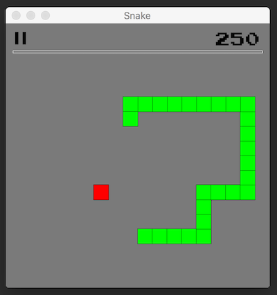
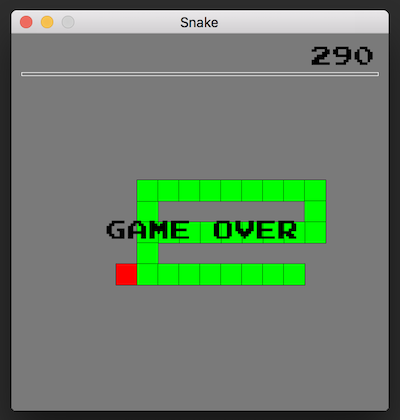

# snake

Snake is the common name for a video game concept where the player maneuvers a line which grows in length, with the line itself being a primary obstacle.

This repository contains an implementation of the game written in `Rust` which uses the [SFML library](https://www.sfml-dev.org/index.php) ([bindings](https://github.com/jeremyletang/rust-sfml)) for the graphics rendering and sounds.

In order to run the game use the cargo run command and specify the size of the window.  
For example: `cargo run 720 720`.

